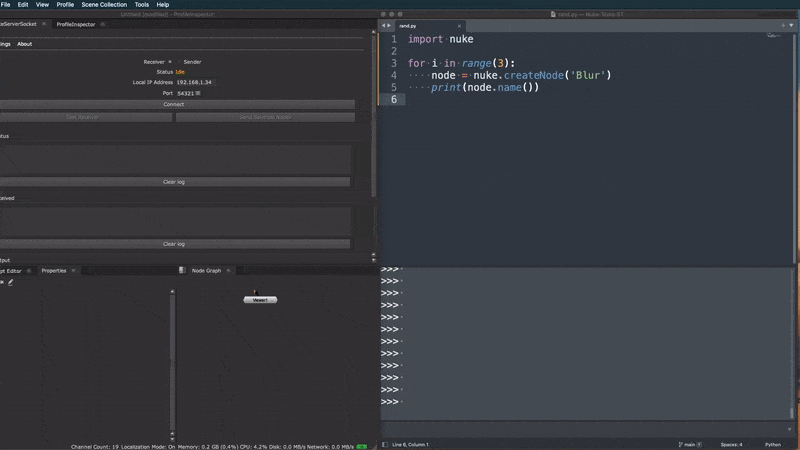

# 1. Nuke Tools ST README

[](https://www.codacy.com/gh/sisoe24/Nuke-Tools-ST/dashboard?utm_source=github.com&amp;utm_medium=referral&amp;utm_content=sisoe24/Nuke-Tools-ST&amp;utm_campaign=Badge_Grade)
[](https://www.codacy.com/gh/sisoe24/Nuke-Tools-ST/dashboard?utm_source=github.com&utm_medium=referral&utm_content=sisoe24/Nuke-Tools-ST&utm_campaign=Badge_Coverage)
[](https://deepsource.io/gh/sisoe24/Nuke-Tools-ST/?ref=repository-badge)

[](https://packagecontrol.io/packages/NukeToolsST)

> This package is a companion extension for [NukeServerSocket](#nukeserversocket) and is based on [NukeTools](https://marketplace.visualstudio.com/items?itemName=virgilsisoe.nuke-tools).

A Sublime Text package to send Python or BlinkScript code inside Nuke.

- [1. Nuke Tools ST README](#1-nuke-tools-st-readme)
  - [1.1. NukeServerSocket](#11-nukeserversocket)
  - [1.2. Features](#12-features)
  - [1.3. Installation](#13-installation)
  - [1.4. Usage](#14-usage)
  - [1.5. BlinkScript](#15-blinkscript)
  - [1.6. Connection](#16-connection)
  - [1.7. Package Settings](#17-package-settings)
  - [1.8. Commands](#18-commands)
  - [1.9. Key Bindings](#19-key-bindings)
  - [1.10. Changelog](#110-changelog)
  - [1.11. Overview](#111-overview)

## 1.1. NukeServerSocket

Download the companion plugin:

- [Github](https://github.com/sisoe24/NukeServerSocket/releases)
- [Nukepedia](http://www.nukepedia.com/python/misc/nukeserversocket)

## 1.2. Features

- Execute code inside Nuke from a machine in your local network.
  - Get the output of Nuke code execution inside Sublime console.
  - When used locally (same machine), the package requires no configuration, just a running server inside Nuke.
  - Specify a custom address when the connection is from/to another computer..
  - BlinkScript support.

## 1.3. Installation

The preferred method of installation is via the [Package Control](https://packagecontrol.io).

- [Package Link](https://packagecontrol.io/packages/NukeToolsST)
- Inside Sublime, invoke the **Command Palette** -> **Install Package** -> **NukeToolsST**.

## 1.4. Usage

[Demo](#110-overview)

Once NukeServerSocket is up and running, you can execute your python/blink file with the new [command](#17-commands).

## 1.5. BlinkScript

> NukeServerSocket >= 0.1.0 is needed in order for this to work.

The extension will create a blinkscript node named after the currently active file.
If the node already exists, it will only modify the code and recompile it.

The accepted file extension code are `.cpp` or `.blink`.

## 1.6. Connection

No settings are necessary if the connection is on the same computer. The package will automatically connect to the localhost and use the port configuration found inside `$HOME/.nuke/NukeServerSocket.ini`. The configuration value is updated every time it's changed inside the plugin.

However, if the connection is between different computers, the port, and hostname, must be changed manually via the [package settings](#package-settings).

> Keep in mind that once the addresses are specified manually, they will always take over the defaults one.

**Note**: Attempting to establish a connection to a manually specified host which is down (i.e., not reachable) will result in a temporary freeze of the Sublime UI for 10 seconds..

## 1.7. Package Settings

- `nss_port`:`integer`

  Set a different value for the connection. The port should match the one from NukeServerSocket.

- `nss_hostname`:`string`

  Same as `nss_port`. The host could be the local host or the local IP.

- `nss_disable_context_menu`:`bool`

  Disable Sublime context menu entry if not needed. Default's to `false`.

Example

```json
{
  "nss_port": 54321,
  "nss_hostname": "192.168.1.60",
  "nss_disable_context_menu": true
}
```

## 1.8. Commands

The following command will be available: `run_nuke_tools`.

A new entry `Run Code inside Nuke`, will be added to the context menu (right-click) when the active file ends with one of the following extensions:

- `.py`
- `.cpp`
- `.blink`

## 1.9. Key Bindings

By default, the package does not include any key bindings. You can add them by following the [Sublime Text Key Bindings guide](https://www.sublimetext.com/docs/key_bindings.html).

Example

```json
[
    {
        "keys" : ["ctrl+alt+n"],
        "command" : "run_nuke_tools"
    }
]
```

## 1.10. Changelog

[0.2.0] 11-04-2021

- Removed most of the commands, leaving only the context menu one.
- Removed default key bindings.
- New configuration to hide context menu.
- Context menu options show only on specific file extensions.

[0.1.0] 10-21-2021

- Initial release.

## 1.11. Overview


